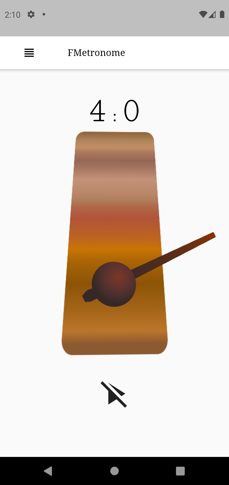
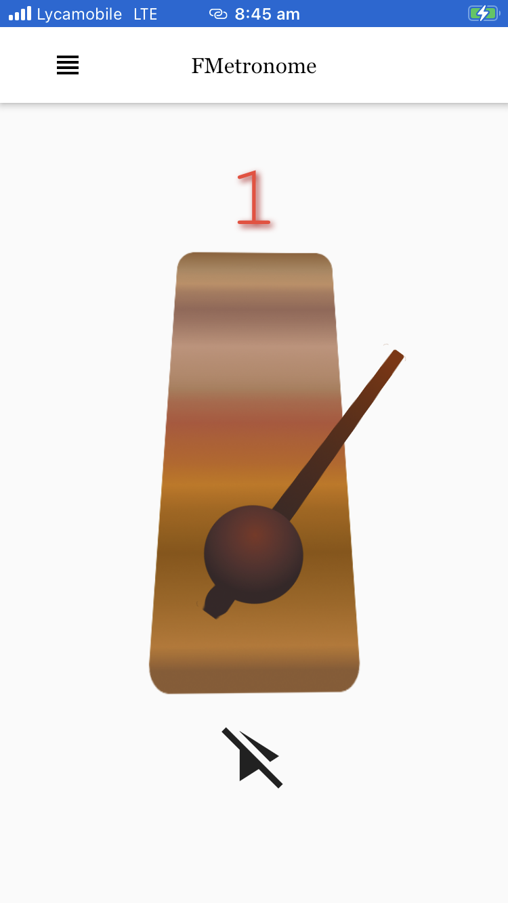
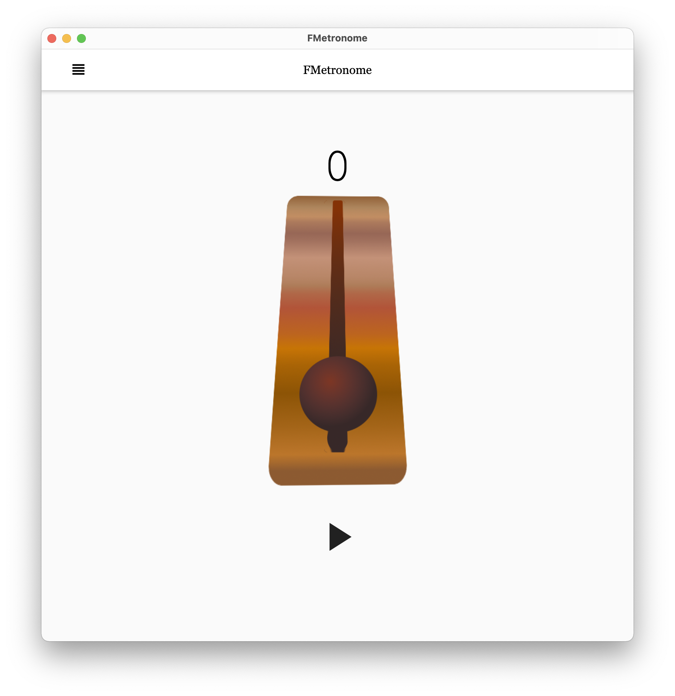

# FMetronome

    

### A simple multi-platform Metronome App.

## Getting Started

This is a project create by Flutter as a single codebase support Android, iOS and MacOS.

- [Download Android version on Google Play](https://play.google.com/store/apps/details?id=com.sicreative.fmetronome)

- [Download MacOS](./macos/app/FMetronome.zip)

### For iOS

You need to build the app in a Mac with XCode installed and with a free Personal Team apple account.

1. Follow this guide to [Install flutter SDK](https://flutter.dev/docs/get-started/install/macos) in MacOS

1. In XCode, choose File>Open, select ios folder, and open Runner.xcworkspace

2. In left file Navigator, Click top item "Runner", and select "Signing & Capabilities"

3. Ensure "Automatically manage signing" is ticked, select "Term" from None to your account (Personal Term free account is fine)

4. At terminal under project folder enter command: flutter clean

5. flutter build ipa

6. Open MacOS Finder,under build/ios/archive/Runner.xcarchive, Right click and select "Show Package Contents"

7. In XCode, Windows>Devices and Simulators, select the device which to install

8. In Finder, Drag and drop the Products/Applications/Runner to the Device&Simulators > "Installed Apps" field.XCode

9. In IOS device, Settings>General>Device Management, Select relative Developer and Trust the Developer.

